<!-- _class: lead -->

# Tu setup de QA no se diseña: se cultiva
## De prompt suelto a skills, rules y hooks.

Edgardo Crovetto · 2026

---

<!-- _class: lead -->

# Una noche perdí 90 minutos

## cazando flaky tests fantasma

<div>
<svg class="dg" viewBox="0 0 1080 176" role="img" aria-label="Dos builds simultáneos contra el mismo ambiente, los dos en rojo">
  <rect class="dg-fail" x="40"  y="0" width="400" height="78" rx="6"/>
  <text class="dg-sm"   x="62"  y="32">build #128 · regression</text>
  <text class="dg-red"  x="62"  y="58">FAILED — 14 tests</text>
  <rect class="dg-fail" x="640" y="0" width="400" height="78" rx="6"/>
  <text class="dg-sm"   x="662" y="32">build #129 · regression</text>
  <text class="dg-red"  x="662" y="58">FAILED — 11 tests</text>
  <path class="dg-wire" d="M240 78 V106 H540 V130 M840 78 V106 H540"/>
  <rect class="dg-skip" x="300" y="130" width="480" height="46" rx="6"/>
  <text class="dg-sm" x="540" y="159" text-anchor="middle">stage · un solo ambiente · unas solas credenciales</text>
</svg>
</div>

Se pisaban entre sí, y nadie lo sabía. Todo <span class="rojo">rojo</span>. **Nada roto.**

**Hoy eso no puede volver a pasarme.
Y no es porque yo me acuerde: es porque mi setup se acuerda por mí.**

Esta charla es la historia de cómo llegué ahí.

---

# Quién soy

**Edgardo Crovetto** · Senior QA automation engineer

Java + TypeScript · tests automatizados · CI/CD · pipelines

**Me gusta mejorar procesos — sobre todo los que ya estaban funcionando.**

> Esta charla no es sobre features. Es sobre **un patrón que se repite** — y lo que hacés con eso.

`linkedin.com/in/edgardocrovetto`

---

# La pregunta de hoy

> ## ¿Puedo automatizar mi proceso de QA con IA?

Spoiler: sí — **sobre las bases que ya tenés.**

---

# Mi setup antes de IA

Plataforma de streaming · servicio backend REST

**Framework:** Java + TestNG + RestAssured + Allure reports + Jira + TestRail + Jenkins

**Pipeline diario:**



> Funcionaba. Pero todo el conocimiento de cada ticket vivía **en mi cabeza**.

---

# Tu día como QA, hoy

- **Análisis del ticket** — Jira + repo + Confluence (AC) + TestRail · nada de eso queda escrito en un solo lugar
- **Mapeo AC ↔ cambio** — comparás docs vs branch a ojo, página por página
- **Test cases + automation** — copiás AC a TestRail, traducís a TestNG/RestAssured, linkeás IDs a mano
- **Ejecución multi-env** — Jenkins contra 3 ambientes · comparás resultados · investigás cada <span class="rojo">rojo</span>
- **PR review** — armás la evidencia, pingeás 2 peers, esperás, re-pingeás
- **Bug encontrado** — abrís ticket, pegás logs, follow-up del ciclo de vida en Jira
- **Mañana** — sesión nueva. Re-explicás el ticket, el plan, las convenciones.

**Mucho de eso es conocimiento que se pierde entre sesiones.**

---

<!-- _class: lead -->

## ¿Y si ese conocimiento **sobreviviera**?

---

<!-- _class: lead -->

# La tesis

# Mi setup no se diseña.

# Se cultiva.

---

# Mis primeros pasos con Claude

**1. Conectar Claude al repo del trabajo**
- Todo arrancó con un `CLAUDE.md` de apenas 5 líneas — se lo pedís en la conversación, no lo escribís a mano
- Lo demás vino con el tiempo

**2. Agregar MCPs, uno a uno**
Jira, TestRail, Jenkins, Confluence — el detalle, en la próxima slide.

A partir de ahí: **prompts del día a día**.
No hubo plan. Aparecieron patrones.

---

# Cómo Claude conoce mi proyecto

<div>
<svg class="dg" viewBox="0 0 1180 274" role="img" aria-label="Jerarquía: CLAUDE.md global, CLAUDE.md del repo y las cuatro piezas del repo">
  <rect class="dg-box" x="0" y="105" width="320" height="64" rx="6"/>
  <text class="dg-ev"   x="18" y="131">~/.claude/CLAUDE.md</text>
  <text class="dg-note" x="18" y="152">preferencias globales · tu identidad</text>
  <rect class="dg-on"  x="370" y="105" width="280" height="64" rx="6"/>
  <text class="dg-ev"   x="388" y="131">proyecto/CLAUDE.md</text>
  <text class="dg-note" x="388" y="152">convenciones del repo</text>
  <path class="dg-wire" d="M320 137 H370"/>
  <path class="dg-wire" d="M650 137 H675 M675 29 V245"/>
  <path class="dg-wire" d="M675 29 H700"/>
  <path class="dg-wire" d="M675 101 H700"/>
  <path class="dg-wire" d="M675 173 H700"/>
  <path class="dg-wire" d="M675 245 H700"/>
  <rect class="dg-on" x="700" y="0" width="470" height="58" rx="6"/>
  <text class="dg-ev"   x="718" y="24">memory/</text>
  <text class="dg-note" x="718" y="44">hechos entre sesiones</text>
  <rect class="dg-on" x="700" y="72" width="470" height="58" rx="6"/>
  <text class="dg-ev"   x="718" y="96">.claude/skills/</text>
  <text class="dg-note" x="718" y="116">workflows invocables</text>
  <rect class="dg-on" x="700" y="144" width="470" height="58" rx="6"/>
  <text class="dg-ev"   x="718" y="168">.claude/rules/</text>
  <text class="dg-note" x="718" y="188">guardrails siempre cargados</text>
  <rect class="dg-on" x="700" y="216" width="470" height="58" rx="6"/>
  <text class="dg-ev"   x="718" y="240">.claude/settings.json</text>
  <text class="dg-note" x="718" y="260">hooks automáticos</text>
</svg>
</div>

Todo es **texto plano en disco**. Versionado. Reviewable.

---

# MCPs — los puentes a sistemas externos

Memory, skills, rules y hooks viven en tu repo.
El trabajo real cruza varios sistemas. Los MCPs los conectan.

*Conectar uno también se pide en conversación — no hay instalador que armar a mano.*

| MCP | Para qué lo uso |
|-----|-----------------|
|  **Jira** | Leer ticket + AC, comentar, transicionar el estado |
|  **TestRail** | Leer/escribir test cases, asociar runs a builds |
|  **Jenkins** | Triggerear builds, leer resultados, descargar logs |
|  **GitHub** | Leer el PR y su diff, postear el review, ver los checks |
|  **Confluence** | Leer specs y acceptance criteria |

Una sola conversación con Claude puede pasar por los **5**.
*El review de la Demo 4 se postea por acá.*

---

# La pirámide de promoción

**Una sola historia:** el typecheck que me olvidaba después de cada rebase,
subiendo un nivel cada vez que el anterior no alcanzó.

<div>
<svg class="dg" viewBox="0 0 1180 268" role="img" aria-label="Pirámide de promoción">
  <rect class="dg-on"   x="160" y="6"   width="200" height="42" rx="5"/>
  <text class="dg-lvl"  x="260" y="33" text-anchor="middle">HOOK</text>
  <text class="dg-note" x="400" y="32">typecheck en cada edit — corre solo, ya no depende de nadie</text>
  <rect class="dg-skip" x="130" y="56"  width="260" height="42" rx="5"/>
  <text class="dg-lvl-d" x="260" y="83" text-anchor="middle">RULE</text>
  <text class="dg-note" x="400" y="82">siempre cargada — pero este dolor la saltea</text>
  <rect class="dg-on"   x="100" y="106" width="320" height="42" rx="5"/>
  <text class="dg-lvl"  x="260" y="133" text-anchor="middle">SKILL</text>
  <text class="dg-note" x="450" y="132">local-build-gate — lo corre Claude cuando hace falta</text>
  <rect class="dg-on"   x="70"  y="156" width="380" height="42" rx="5"/>
  <text class="dg-lvl"  x="260" y="183" text-anchor="middle">MEMORY</text>
  <text class="dg-note" x="480" y="182">feedback-local-build-before-ci — y me lo olvidé igual</text>
  <rect class="dg-on"   x="40"  y="206" width="440" height="42" rx="5"/>
  <text class="dg-lvl"  x="260" y="233" text-anchor="middle">PROMPT SUELTO</text>
  <text class="dg-note" x="510" y="232">"acordate del typecheck antes de CI", una y otra vez</text>
</svg>
</div>

**Saltea la Rule** — y no es olvido: una rule me lo *recuerda*, y el problema
era justamente que recordármelo no alcanzaba. **Pocas piezas llegan hasta
arriba**: no es una escalera que subís entera, es un menú. La Rule tiene su
propia cicatriz — `no-parallel-ci`, los 90 minutos del principio.

> Ninguna pieza se diseñó. Cada una fue admitir que acordarse no escala.

---

<!-- _class: dense -->

# Un skill no siempre ejecuta: a veces delega

`multi-agent-pr-review` es un `SKILL.md` como cualquier otro — markdown en tu
repo, la misma pirámide. Lo distinto es lo que hace adentro: en vez de correr
pasos él mismo, **despacha subagentes.** Cada uno con su propio contexto: no ve
tu historial, y al principal solo le vuelve el resumen.



**Antes de que un peer humano vea el PR, ya pasó por 5 revisores especializados**,
cada uno cazando su propia clase de bug. Al peer le queda lo que un especialista
de tipos no puede ver: arquitectura. *(Mis compañeros aplaudieron esto.)*

**Lo que no cambia: quien aprueba sigue siendo responsable de lo que aprueba.**

---

# El flujo end-to-end

<div>
<svg class="dg" viewBox="0 0 1180 250" role="img" aria-label="Flujo end-to-end: etapa, skill y pieza que se activa">
  <g class="dg-col">
    <text class="dg-stage" x="102"  y="16" text-anchor="middle">PLAN</text>
    <text class="dg-stage" x="345"  y="16" text-anchor="middle">IMPLEMENT</text>
    <text class="dg-stage" x="588"  y="16" text-anchor="middle">PUSH</text>
    <text class="dg-stage" x="831"  y="16" text-anchor="middle">REVIEW</text>
    <text class="dg-stage" x="1074" y="16" text-anchor="middle">TRIAGE</text>
  </g>
  <rect class="dg-on" x="0"   y="28" width="205" height="58" rx="6"/>
  <text class="dg-sm" x="102" y="52"  text-anchor="middle">ticket-coverage-</text>
  <text class="dg-sm" x="102" y="70"  text-anchor="middle">gap-analysis</text>
  <rect class="dg-on" x="243" y="28" width="205" height="58" rx="6"/>
  <text class="dg-sm" x="345" y="52"  text-anchor="middle">superpowers:</text>
  <text class="dg-sm" x="345" y="70"  text-anchor="middle">TDD</text>
  <rect class="dg-on" x="486" y="28" width="205" height="58" rx="6"/>
  <text class="dg-sm" x="588" y="62"  text-anchor="middle">local-build-gate</text>
  <rect class="dg-on" x="729" y="28" width="205" height="58" rx="6"/>
  <text class="dg-sm" x="831" y="52"  text-anchor="middle">multi-agent-</text>
  <text class="dg-sm" x="831" y="70"  text-anchor="middle">pr-review</text>
  <rect class="dg-on" x="972" y="28" width="205" height="58" rx="6"/>
  <text class="dg-sm" x="1074" y="62" text-anchor="middle">ci-failure-triage</text>
  <path class="dg-wire" d="M102 86 V112 M345 86 V112 M588 86 V112 M831 86 V112 M1074 86 V112"/>
  <rect class="dg-pill" x="0"   y="112" width="205" height="52" rx="26"/>
  <text class="dg-pc" x="102" y="134" text-anchor="middle">SKILL</text>
  <text class="dg-pn" x="102" y="152" text-anchor="middle">se queda acá</text>
  <rect class="dg-pill" x="243" y="112" width="205" height="52" rx="26"/>
  <text class="dg-pc" x="345" y="134" text-anchor="middle">HOOK</text>
  <text class="dg-pn" x="345" y="152" text-anchor="middle">typecheck on edit</text>
  <rect class="dg-pill" x="486" y="112" width="205" height="52" rx="26"/>
  <text class="dg-pc" x="588" y="134" text-anchor="middle">RULE</text>
  <text class="dg-pn" x="588" y="152" text-anchor="middle">no-parallel-ci</text>
  <rect class="dg-pill" x="729" y="112" width="205" height="52" rx="26"/>
  <text class="dg-pc" x="831" y="134" text-anchor="middle">5 SUBAGENTES</text>
  <text class="dg-pn" x="831" y="152" text-anchor="middle">en paralelo</text>
  <rect class="dg-pill" x="972" y="112" width="205" height="52" rx="26"/>
  <text class="dg-pc" x="1074" y="134" text-anchor="middle">MEMORY</text>
  <text class="dg-pn" x="1074" y="152" text-anchor="middle">known-issues</text>
  <path class="dg-base" d="M0 190 H1177"/>
  <text class="dg-note" x="0" y="184">memory + rules cargadas todo el tiempo</text>
  <text class="dg-tick" x="0" y="222">⟳ corrección repetida 3× ──▶ writing-skills ──▶ skill nueva</text>
</svg>
</div>

**Cada pieza compone con las demás.** No hay un workflow único — hay piezas.

---

<!-- _class: lead -->

# Ahora, en vivo

## Un día de QA, del ticket al merge

6 escenas a lo largo de una jornada de 8 horas · repo `claude-qa-demo`

<div>
<svg class="dg" viewBox="0 0 1080 104" role="img" aria-label="Las 6 escenas ubicadas en una jornada de 9:00 a 17:00">
  <path class="dg-base" d="M75 30 H1005"/>
  <circle class="dg-d-s" cx="75" cy="30" r="5"/>
  <text class="dg-tick" x="75" y="20" text-anchor="middle">9:00</text>
  <text class="dg-pn" x="75" y="52" text-anchor="middle">Ticket → plan</text>
  <circle class="dg-d-s" cx="191" cy="30" r="5"/>
  <text class="dg-tick" x="191" y="20" text-anchor="middle">10:00</text>
  <text class="dg-pn" x="191" y="52" text-anchor="middle">TDD asistido</text>
  <circle class="dg-d-s" cx="366" cy="30" r="5"/>
  <text class="dg-tick" x="366" y="20" text-anchor="middle">11:30</text>
  <text class="dg-pn" x="366" y="52" text-anchor="middle">Gate local</text>
  <circle class="dg-d-s" cx="656" cy="30" r="5"/>
  <text class="dg-tick" x="656" y="20" text-anchor="middle">14:00</text>
  <text class="dg-pn" x="656" y="52" text-anchor="middle">PR review</text>
  <circle class="dg-d-s" cx="773" cy="30" r="5"/>
  <text class="dg-tick" x="773" y="20" text-anchor="middle">15:00</text>
  <text class="dg-pn" x="773" y="52" text-anchor="middle">Triage de CI</text>
  <circle class="dg-d-s" cx="889" cy="30" r="5"/>
  <text class="dg-tick" x="889" y="20" text-anchor="middle">16:00</text>
  <text class="dg-pn" x="889" y="52" text-anchor="middle">Prompt → skill</text>
  <text class="dg-pn" x="511" y="52" text-anchor="middle">— almuerzo —</text>
  <circle class="dg-future" cx="1005" cy="30" r="5"/>
  <text class="dg-tick" x="1005" y="20" text-anchor="middle">17:00</text>
  <text class="dg-pn" x="1005" y="52" text-anchor="middle">se termina</text>
  <text class="dg-note" x="540" y="90" text-anchor="middle">todo offline · cada escena deja algo para la siguiente</text>
</svg>
</div>

*El demo está en TypeScript para que entre en pantalla y compile rápido.
El patrón es **idéntico** en Java/TestNG/RestAssured.*

---

# Demo 1 · 9:00 — Ticket → plan de cobertura

> *↩ Resuelve: las 4 pestañas para armar el panorama completo.*

**Input:** un ticket de Jira mockeado en `mocks/jira/DEMO-100.json`.

**Prompt:**
> *"Planificá el trabajo para DEMO-100."*

**Skill invocada:** `ticket-coverage-gap-analysis`

**Output:**
- Mapa de cobertura existente (tabla)
- Gaps identificados (✅ / ⚠️ / ❌)
- TodoWrite con casos propuestos + estimación

*El plan queda con un ❌: slug malformado sin cubrir. →*

---

# Demo 2 · 10:00 — TDD asistido

> *↩ Resuelve: saltar el "<span class="rojo">red</span>" y aterrizar directo en código sin test que lo respalde.*

Demo 1 dejó un ❌: **DEMO-100 pide que un slug malformado sea rechazado.**
Hoy `getChannelBySlug('News Channel!')` devuelve `null`, como si no existiera.

**Prompt:**
> *"Cerrá ese gap con TDD."*

**Skill invocada:** `superpowers:test-driven-development`
*(descargada del marketplace, no la escribí yo)*

1. Test que espera el rechazo → **<span class="rojo">red</span>**
2. Validación mínima del formato → **<span class="verde">green</span>**
3. Refactor opcional

El skill guía el orden — y hoy lo respetó.

*Gap cerrado, tests <span class="verde">verdes</span>. Ahora quiero correr esto en CI. →*

---

# Demo 3 · 11:30 — Gate local antes de CI

> *↩ Resuelve: pushear un cambio con un typo y enterarte 10 minutos después, cuando Jenkins ya arrancó el build.*

**Prompt:**
> *"Triggeá un build de Jenkins para esta branch."*

Lo que pasa en vivo:
1. `local-build-gate` → typecheck + tests locales ✅
2. `no-parallel-ci.mdc` → **build 43 ya está corriendo en stage** (`build-43-running.json`)
3. Claude **se niega a triggerear**: esperar ~12 min o cambiar de env

**El guardrail no me cuida a mí del agente — nos cuida a los dos del incidente.**
Los 90 minutos del principio, exactamente.

*Build 43 termina, corre el mío, abro el PR. →*

---

# Demo 4 (1/2) · 14:00 — Multi-agent PR review ⭐

> *↩ Resuelve: repetir los mismos comentarios review tras review.*

PR sembrado con 5 bugs distintos (`mocks/github/pr-7.diff`):
- `silent-failure-hunter` → `catch (e) { return [] }` se traga errores
- `type-design-analyzer` → `as Channel` miente
- `comment-analyzer` → comentario que dice "sorted" pero no ordena
- `pr-test-analyzer` → test que solo verifica `toBeDefined()`
- `code-reviewer` → `// TODO` en producción

**Dispatch:** 5 agentes en paralelo, **un solo mensaje**.

---

# Demo 4 (2/2) — el resultado agregado

<div class="gh">
  <div class="gh-bar">claude · comentó en <b>#7</b> · hace 1 minuto</div>
  <div class="gh-body">
    <div class="gh-h">Review summary</div>
    <div class="gh-row"><span class="gh-b">BLOCKERS</span> silent-failure-hunter · 1</div>
    <div class="gh-row"><span class="gh-s">SUGGESTIONS</span> type-design-analyzer · 1 &nbsp; comment-analyzer · 1 &nbsp; pr-test-analyzer · 1</div>
    <div class="gh-row"><span class="gh-n">NITPICKS</span> code-reviewer · 1</div>
    <div class="gh-det">▸ Per-axis details</div>
  </div>
</div>

5× paralelo, contexto aislado, 1 comentario al final.

**Lo leo entero antes de postearlo. Si alguien pregunta por qué se bloqueó
el PR, la respuesta soy yo — "no sé, lo hizo la IA" no es una respuesta.**

---

# ¿Y esto no lo hacía ya un linter?

Buena parte sí — y **el linter no se saca**: es más barato y no se cansa.

SonarQube marca ese `catch` que ignora la excepción (`S2486`). Lo que no ve es
que el comentario dice *"sorted"* sobre código que no ordena, ni que un
`toBeDefined()` no prueba nada.

**El linter matchea patrones. El subagente lee.** Van juntos.

*Review adentro. Antes del merge, la regression completa en Jenkins. →*

---

# Demo 5 · 15:00 — Triage de fallas de CI

> *↩ Resuelve: triagear tests <span class="rojo">rojos</span> a mano contra known-issues.*

**Input:** `mocks/jenkins/build-44.json` — 5 <span class="rojo">rojos</span> **sin etiquetar**: nombre,
mensaje, stack y los commits. Y es **la misma branch de hoy**:
`feature/DEMO-100-channels-coverage`.

**Skill invocada:** `ci-failure-triage` + registry `memory/known-issues.md`

| Categoría | De dónde sale |
|---|---|
| Flaky test conocido | La firma matchea el registry (2× `Test timed out in 5000ms`, visto hasta build 39) |
| Infra | El ambiente no responde (`ECONNREFUSED` a auth) |
| Regresión real | No está en el registry **y** el commit toca código relacionado |

**La categoría se deduce de la evidencia — no viene dada en el JSON.**

---

# El triage no termina en la categoría

Son 5 fallas para que entren en pantalla. En un build de cientos, el mismo
skill lee los **logs completos**, agrupa las fallas relacionadas entre sí y
te dice **por dónde empezar a mirar** — no solo "esto es un flaky test".

*Triage hecho. Pero hoy, tres veces, me corregiste lo mismo... →*

---

# Demo 6 · 16:00 — De prompt repetido a skill 🪄

> *↩ Resuelve: re-explicar el ticket, el plan, las convenciones en una sesión nueva.*

Durante la sesión, Claude fue corregido **3 veces** con
*"acordate de chequear X antes de Y"*.

**Prompt:**
> *"Esto ya te lo repetí 3 veces. ¿Lo convertimos en skill?"*

**Skill invocada:** `superpowers:writing-skills`
*(alternativa del marketplace: el plugin `skill-creator`)*

Output: un `SKILL.md` nuevo en `.claude/skills/`.

La slide del principio terminaba:
*"Mañana — sesión nueva. Re-explicás el ticket, el plan, las convenciones."*

**Mañana — sesión nueva. No se re-explica ni el ticket,
ni el plan, ni las convenciones.**

**Este es el patrón completo en acción.**

---

# Y no siempre tenés que contar vos

Hoy lo repetí 3 veces y lo noté. Cuando no lo notás, se lo preguntás:

> *"Revisá las últimas conversaciones y decime qué skills hay que crear o actualizar."*

El patrón es el mismo — cambia quién lo detecta.

---

# Mi línea de tiempo real

<div>
<svg class="dg" viewBox="0 0 1180 414" role="img" aria-label="Línea de tiempo: qué pieza apareció en qué semana y qué dolor la causó">
  <path class="dg-wire" d="M108 12 V404"/>
  <circle class="dg-d-m" cx="108" cy="26" r="5"/>
  <text class="dg-wk" x="96" y="31" text-anchor="end">semana 1</text>
  <text class="dg-tier dg-t-m" x="126" y="31">BASE</text>
  <text class="dg-ev" x="200" y="31">CLAUDE.md inicial: 5 líneas <tspan class="w">— nombre, comando de test, convención de commits</tspan></text>
  <circle class="dg-d-s" cx="108" cy="60" r="5"/>
  <text class="dg-wk" x="96" y="65" text-anchor="end">semana 1</text>
  <text class="dg-tier dg-t-s" x="126" y="65">SKILL</text>
  <text class="dg-ev" x="200" y="65">local-build-gate <tspan class="w">— CI roto 2 veces por un typo que typecheck cazaba en 2 seg</tspan></text>
  <circle class="dg-d-r" cx="108" cy="94" r="5"/>
  <text class="dg-wk" x="96" y="99" text-anchor="end">semana 3</text>
  <text class="dg-tier dg-t-r" x="126" y="99">RULE</text>
  <text class="dg-ev" x="200" y="99">no-parallel-ci <tspan class="w">— los 90 minutos cazando flaky tests fantasma en stage</tspan></text>
  <circle class="dg-d-r" cx="108" cy="128" r="5"/>
  <text class="dg-wk" x="96" y="133" text-anchor="end">semana 3</text>
  <text class="dg-tier dg-t-r" x="126" y="133">RULE</text>
  <text class="dg-ev" x="200" y="133">english-only <tspan class="w">— un compañero no podía revisar un commit en español</tspan></text>
  <circle class="dg-d-s" cx="108" cy="162" r="5"/>
  <text class="dg-wk" x="96" y="167" text-anchor="end">semana 6</text>
  <text class="dg-tier dg-t-s" x="126" y="167">SKILL</text>
  <text class="dg-ev" x="200" y="167">ci-failure-triage <tspan class="w">— las mismas 3 preguntas cada lunes</tspan></text>
  <circle class="dg-d-s" cx="108" cy="196" r="5"/>
  <text class="dg-wk" x="96" y="201" text-anchor="end">semana 6</text>
  <text class="dg-tier dg-t-s" x="126" y="201">SKILL</text>
  <text class="dg-ev" x="200" y="201">known-issues-registry-update <tspan class="w">— perdía el registro de qué flaky test ya vi</tspan></text>
  <circle class="dg-d-s" cx="108" cy="230" r="5"/>
  <text class="dg-wk" x="96" y="235" text-anchor="end">semana 9</text>
  <text class="dg-tier dg-t-s" x="126" y="235">SKILL</text>
  <text class="dg-ev" x="200" y="235">multi-agent-pr-review <tspan class="w">+ plugin pr-review-toolkit — de secuencial a paralelo</tspan></text>
  <circle class="dg-d-h" cx="108" cy="264" r="5"/>
  <text class="dg-wk" x="96" y="269" text-anchor="end">semana 11</text>
  <text class="dg-tier dg-t-h" x="126" y="269">HOOK</text>
  <text class="dg-ev" x="200" y="269">typecheck-after-edit <tspan class="w">— memory + rule no alcanzaban</tspan></text>
  <circle class="dg-d-s" cx="108" cy="298" r="5"/>
  <text class="dg-wk" x="96" y="303" text-anchor="end">semana 13</text>
  <text class="dg-tier dg-t-s" x="126" y="303">SKILL</text>
  <text class="dg-ev" x="200" y="303">ticket-coverage-gap-analysis <tspan class="w">— la misma conversación 4 sprints seguidos</tspan></text>
  <circle class="dg-d-m" cx="108" cy="332" r="5"/>
  <text class="dg-wk" x="96" y="337" text-anchor="end">semana 16</text>
  <text class="dg-tier dg-t-m" x="126" y="337">MEMORY</text>
  <text class="dg-ev" x="200" y="337">heurística de flaky tests en stage <tspan class="w">— 80% de los rojos no eran regresiones</tspan></text>
  <circle class="dg-d-h" cx="108" cy="366" r="5"/>
  <text class="dg-wk" x="96" y="371" text-anchor="end">ahora</text>
  <text class="dg-ev" x="126" y="371">El setup quedó versionado en el repo <tspan class="w">— los compañeros lo mejoran con sus propias PRs</tspan></text>
  <circle class="dg-future" cx="108" cy="400" r="5"/>
  <text class="dg-wk" x="96" y="405" text-anchor="end">futuro</text>
  <text class="dg-ev" x="126" y="405"><tspan class="w">Nuevas ideas, nuevas necesidades — seguimos buscando patrones</tspan></text>
</svg>
</div>

**Nada se planificó. Cada pieza respondió a un dolor concreto.**

---

# El agente también construye

Cultivar no es solo skills, rules y memory **para** el agente.
Es lo que el agente construye **con vos**:

- **CI a tu medida** — el pipeline corre con tus reglas, no con las heredadas
- **Linters / checkstyle / SonarQube** — configurados y explicados, no copiados de un gist
- **Coverage y notificaciones** — Allure, dashboards, el build roto te encuentra a vos

El hook de typecheck que viste hace rato **es exactamente este patrón** —
aplicado a un linter o a un quality gate, la conversación es la misma.

> **No le tengas miedo a lo desconocido: el costo de aprender colapsó.**
> Cultivás al agente — y el proyecto queda mejor armado que antes.

---

<!-- _class: dense -->

# Qué le toca a la persona

| | El agente | Vos |
|---|---|---|
| **Ejecución** | Corre el procedimiento, agrega resultados, propone cambios de código para revisar | — |
| **Criterio** | — | Interpretás un AC ambiguo, decidís qué es "suficiente" |
| **Aporte** | — | Metés lo que el agente no vio: charlas, discusiones, decisiones de negocio — enriquecés, corregís |
| **Revisión** | Hace el primer pase (5 subagentes en paralelo) | Leés el resultado antes de postearlo o mergear |
| **Decisión** | — | Aprobás, bloqueás, o decidís qué se promueve a skill/rule |
| **Responsabilidad** | — | Si preguntan por qué, la respuesta sos vos |

**El agente ejecuta. La persona aporta lo que falta, decide, revisa y
responde por el resultado — eso no se delega.**

*Mismo criterio que en la Demo 4: se lee entero antes de postearlo —*
**"no sé, lo hizo la IA" no es una respuesta válida.**

---

<!-- _class: lead -->

## La pregunta del principio

# ¿Puedo automatizar mi proceso de QA con IA?

**Sí — lo acabás de ver.**
**¿Se diseña? No. Se cultiva.**

---

# 4 pasos para el lunes

**1. Un `CLAUDE.md` de 5 líneas** en el repo donde más trabajás.
Nombre del proyecto, comando de test, convención de commits. Nada más.

**2. Probá hacer todo con el agente, aunque hoy lo hagas por fuera.**
Leer el ticket de Jira, estudiar la story, compararla contra el código.
Ahí empiezan a aparecer los patrones repetibles.

**3. Anotá la próxima corrección que repitas.**
La segunda vez que escribís *"acordate de X antes de Y"*, eso es una memory.
La tercera, un skill.

**4. Bajá lo que ya existe:** `/plugin` → `superpowers` + `pr-review-toolkit`.
Arrancás con workflows que no tuviste que escribir. Son públicos: usá los de
confianza, los que tu organización ya aceptó.

> Nada de esto necesita presupuesto, permiso, ni una reunión de arquitectura.

---

<!-- _class: lead -->

# Tu setup no se diseña.
# Se cultiva.

**Memory + Skills + Rules + Hooks = workflow reproducible**

**Cultivarlo no te saca del medio: el criterio, el dominio y la firma siguen siendo tuyos.**

## ¿Preguntas?

`github.com/edcrove/claude-qa-demo`
`linkedin.com/in/edgardocrovetto`

---

<!-- _class: lead -->

# Apéndice

## Anatomía y ejemplo real de cada pieza

Memory · Skill · Rule · Hook

---

# Memory — anatomía

Una corrección repetida **2 veces** es candidata a memory.

**Prompt:**
> *"Guardá esto en memory: <la corrección o el hecho>."*

```markdown
---
name: kebab-case-slug
description: <One-line summary; Claude lo usa para decidir si traer este recuerdo>
metadata:
  type: feedback | user | project | reference
---

<Body: el hecho, la preferencia, la corrección>

**Why:** <razón concreta — usualmente un incidente pasado>
**How to apply:** <cuándo aplica>
```

Ese prompt es lo único que hace falta — Claude arma el archivo. Persiste
entre sesiones. Sobrevive al `/clear`.

---

# Memory — ejemplo real

**Prompt:**
> *"Guardá esto en memory: corré typecheck y tests locales antes de
> cualquier build remoto. Me olvidé 2 veces después de un rebase."*

```markdown
---
name: feedback-local-build-before-ci
description: Always run local typecheck + tests before triggering remote CI
metadata:
  type: feedback
---

Run `npm run typecheck && npm test` before any remote CI build.

**Why:** failed CI runs burn ~10 minutes per attempt.
**How to apply:** see `local-build-gate` skill.
```

Nació después de olvidarme el `typecheck` post-rebase un lunes a la mañana.

---

# Skill — anatomía

**Prompt:**
> *"Convertí esto en un skill."*

```markdown
---
name: kebab-case-name
description: Use when <trigger>. <One-sentence summary.>
---

# Title

## When to use
- Concrete trigger 1
- Concrete trigger 2

## Steps
1. Concrete and verifiable
2. ...

## Output
What the skill produces.
```

`description` es el campo crítico: Claude lo usa para decidir si invocar.

---

# Skill — ejemplo real

**Prompt:**
> *"Rompí el build dos veces esta semana por lo mismo. Convertí el
> chequeo local en un skill."*

```markdown
---
name: local-build-gate
description: Use before triggering remote CI to fail fast on
  compile or unit-test errors. Saves ~10 min per broken push.
---

# Local build gate

1. **Typecheck:** cd demo-app && npm run typecheck
2. **Unit tests:** cd demo-app && npm test
3. **Smoke check:** call the endpoint once

## When to skip
Never. Compose with `no-parallel-ci.mdc`.
```

Nació después de romper el build dos veces en la misma semana.

---

# Rule — anatomía

**Prompt:**
> *"Convertí esto en una rule — quiero que esté siempre presente."*

```markdown
---
description: One-line summary, ≤ 120 chars, present tense
---

Rule statement: what you must / must not do.

**Why:** the reason — often a past incident.
**How to apply:** when this kicks in.
```

A diferencia de un skill, **siempre está cargada** en el contexto.

---

# Rule — ejemplo real

**Prompt:**
> *"Esto no puede volver a pasar. Regla: nunca triggerear un build
> si ya hay otro corriendo en el mismo ambiente."*

```markdown
---
description: Never trigger two CI builds in parallel against
  the same TEST_ENV — they share credentials.
---

Before triggering a CI build:
1. Check whether another build is already running on the env.
2. If yes, wait or pick a different env. Do not queue parallel.

**Why:** parallel runs share credentials → mutual interference
that looks like real regressions but isn't.
```

Nació después de 90 minutos cazando flaky tests fantasma.

---

# Hook — anatomía

**Prompt:**
> *"Convertí esto en un hook — que corra solo, sin que nadie lo invoque."*

```json
{
  "hooks": {
    "PostToolUse": [{
      "matcher": "Edit|Write|MultiEdit",
      "hooks": [{
        "type": "command",
        "command": "<bash command>"
      }]
    }]
  }
}
```

Se engancha a momentos del ciclo: antes (`PreToolUse`) y después
(`PostToolUse`) de cada tool, cierre de sesión (`Stop`), entre otros.
El comando recibe el evento como **JSON por stdin**.

**No depende del modelo:** lo dispara el runtime de Claude Code y siempre se ejecuta.

---

# Hook — ejemplo real

**Prompt:**
> *"Me olvidé el typecheck 5 veces seguidas — teniendo memory y skill.
> Convertilo en hook: que corra en cada edit, pase lo que pase."*

```json
{
  "hooks": {
    "PostToolUse": [{
      "matcher": "Edit|Write|MultiEdit",
      "hooks": [{
        "type": "command",
        "command": "f=$(jq -r '.tool_input.file_path // empty');
                    case \"$f\" in \"$CLAUDE_PROJECT_DIR\"/*.ts)
                      cd \"$CLAUDE_PROJECT_DIR/demo-app\" && npm run typecheck;;
                    esac"
      }]
    }]
  }
}
```

El path sale del JSON de stdin con `jq` — no de una variable de entorno.

Nació después de olvidarme el `typecheck` 5 veces seguidas — **teniendo
el memory y el skill**. El hook fue el final del camino.

---

<!-- _class: lead -->

# Backup — Q&A

## Respuestas que suelen hacer falta

---

# ¿Y los costos en tokens?

- El día a día corre en un modelo mid-tier; el multi-agent review es el único paso caro
- 5 subagentes = 5 contextos aislados — pagás tokens para **no** pagar contexto contaminado
- El costo contra el que se compara: 10 min de CI roto · 90 min de flaky
  tests fantasma · un review que espera 2 días
- Memory, rules y hooks cuestan ~0: texto plano en el contexto que ya pagás

---

# ¿Qué pasa cuando cambia el modelo?

- Los **prompts** afinados a un modelo a veces mueren con él
- **Skills, rules y memory sobreviven** — describen tu proceso, no al modelo
- El **hook** ni siquiera pasa por el modelo: lo ejecuta el runtime
- Por eso la pirámide promociona hacia arriba: **cada nivel es más robusto al cambio**

---

# ¿Funciona offline? ¿Sirve en mi stack?

- Este demo corre **100% offline**: mocks JSON en disco, cero credenciales
- Solo los **MCPs** reales (Jira, Jenkins, TestRail, GitHub) necesitan red
- El patrón no sabe de lenguajes: idéntico en **Java/TestNG/RestAssured**
- Todo es texto plano: clonalo y reemplazá los mocks por tus sistemas

---

# ¿Quién audita al clasificador de CI?

- `ci-failure-triage` no decide a ciegas: la categoría sale de evidencia
  visible (firma en el registry, stack, commits) — no es una caja negra
- El registry (`memory/known-issues.md`) lo propone el agente y lo confirmás
  vos antes de commitear, y pide **2+ sightings** — un solo fallo nunca es un
  flaky test
- Si la categoría no cierra con evidencia, **regresión real es el default**
  — el skill sesga hacia flaggear de más, no de menos
- Igual que en la Demo 4: el agente propone la categoría, vos la confirmás
  antes de actuar
